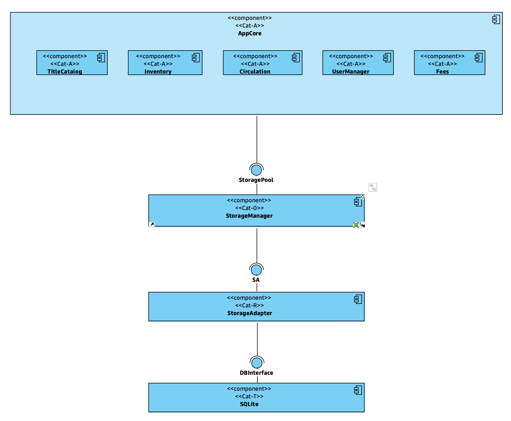

# LiMa - A Library Manager

This is an information system for managing the typical processes of a library. It hast been built
for educational purposes, in order to show and explain the principles of a software architecture
which conforms to the concepts presented in: 

- Johannes Siedersleben: *Moderne Software-Architektur*, dpunkt.verlag, 2004. 

## Software Categories  

The main idea of this book is, that the components of a software architecture can be categorized into the following classes:
- **$0$-Software**: This is software that is neither application specific nor does it know some technical APIs. Examples are container data types, basic algorithms for sorting and searching, math libraries etc.
- **A-Software**: Application software that implements the business logic and is independent of any technical APIs.
- **T-Software**: Technical software that knows at least one technical API (like ODBC, JSON)

A good and maintainable architecture should avoid AT-Software (i.e. a mixture of A- and T-software). In order to connect A-components and T-componentes, so-called **R-Software** should be used. That is software which translates from one **R**epresentation to another (i.e. from the business domain to  the technical world and vice versa).

R-Software has in many cases a simple structure, so that it may be generated automatically based on some configuration data.

## Current State

The software in this repo is a work in progress. It focuses currently on the subsystems
- [`AppCore`](@ref): the business logic (→ A-Software)
- [`StorageManager`](@ref StorageManager): a component responsible for storing and retrieving data; the `StorageManager` itself is a technology-neutral object manager [→ $0$-Software].
  - It is using a relational DBMS (SQLite in this case) for storing the objects; from the Julia-side `SQLite.jl` and `DBInterface.jl`are used for access  [→ T-Software]
  - In between there is a layer of R-Software (`StorageAdapter`) to connect both worlds 
  
  *Note*: In a more realistic scenario, the `StorageManager`wouldn‘t be a sub-package of `LiMa`, but a stand-alone package which would be used by `AppCore`.




## Business Logic in AppCore

The application core consists of the following components:
- `UserManager`
- `TitleCatalog`
- `InventoryManager`
- `CirculationManager`
- `Fees`

```@docs
  AppCore.UserManager
```

```@docs
  AppCore.TitleCatalog
```
